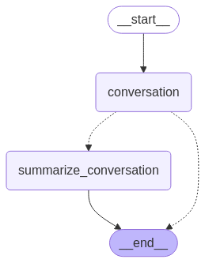

# LangGraph Templates

Este repositório contém templates reutilizáveis para construir aplicações baseadas em LangGraph, facilitando o desenvolvimento de fluxos de processamento de linguagem natural e agentes de IA.

## Sobre o LangGraph

[LangGraph](https://github.com/langchain-ai/langgraph) é uma biblioteca para construir agentes de IA e fluxos de processamento de linguagem natural usando grafos. Ela é uma extensão do ecossistema LangChain que facilita a criação de aplicações complexas baseadas em LLMs (Large Language Models).

## Estrutura do Repositório

O repositório está organizado com os seguintes templates:

- **Agentes sem ou com Memória**: Template para agentes de IA com ferramentas e memória


- **Chatbot com Resumo**: Template para chatbots com histórico de conversas utilizando resumos



- **Chatbot com Filtro**: Template para chatbots com histórico de conversas utilizando filtros


- **Roteador**: Template para roteadores de conversas


## Requisitos

- Python 3.11+
- Dependências listadas no `requirements.txt`

## Instalação

```bash
# Clone o repositório
git clone https://github.com/josericardo.fo/langgraph_templates.git

# Entre no diretório
cd langgraph_templates

# Instale as dependências
pip install -r requirements.txt
```

## Como usar

Cada template inclui um exemplo pronto para uso que pode ser adaptado para diferentes casos de uso. Para utilizar um template, acesse o arquivo `main.py` e mude a importação do template desejado. Exemplo:

```python
from templates.agent import get_response
```

Depois, execute o script `main.py` para testar o template:

```bash
cd app
python main.py
```
